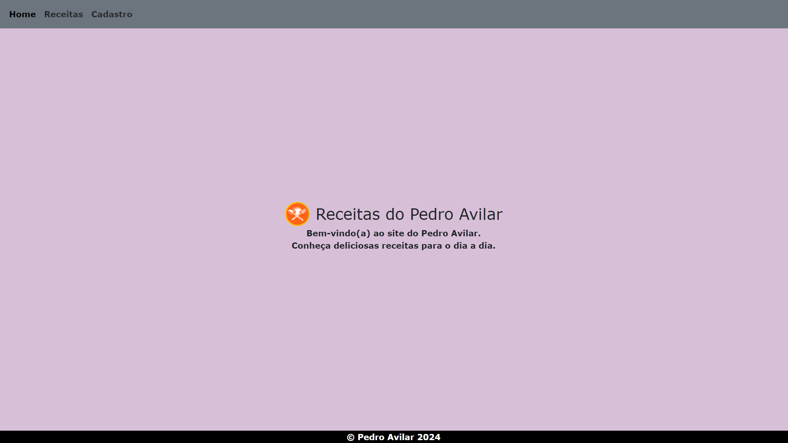
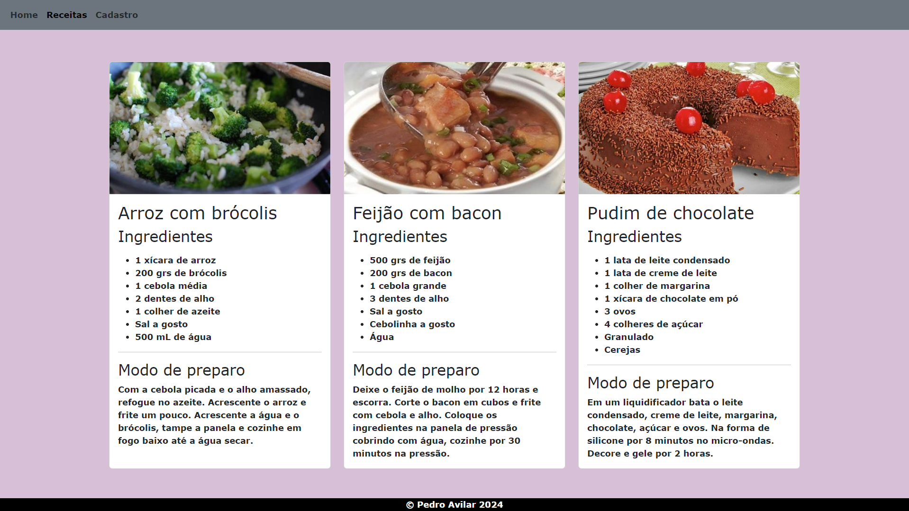
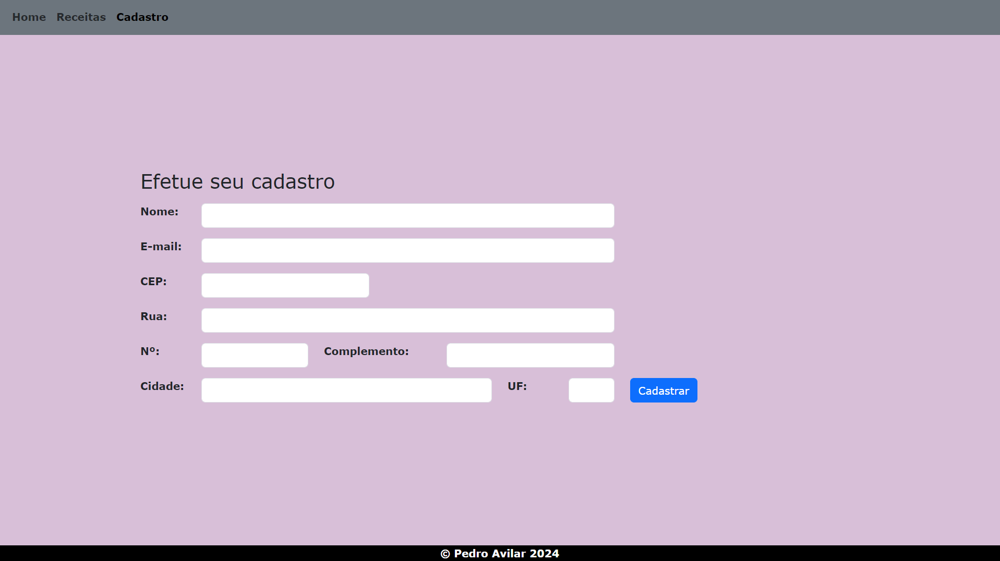

# Faculdade Estácio
## Curso Desenvolvimento Full Stack
## Mundo 2 - Nível 1
## Pedro Wilson Araújo Avilar

Implementação de um site voltado para o fornecimento de receitas culinárias,
com a utilização apenas de HTML e CSS.

Para visualizar o site [clique aqui](https://pedroavilar.github.io/site-receitas/).

### Capturas de tela do site:
Tela de início

Tela de receitas

Tela de cadastro

